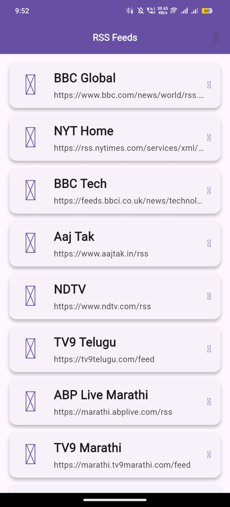
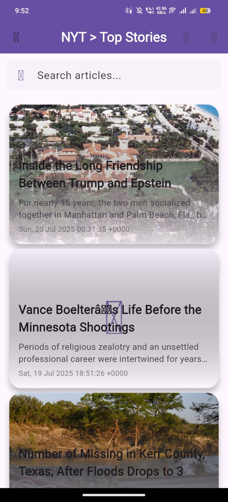
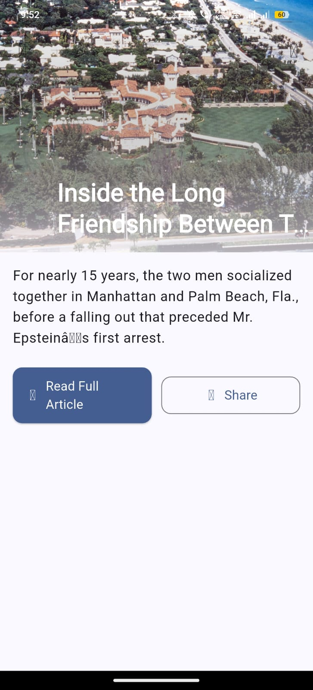
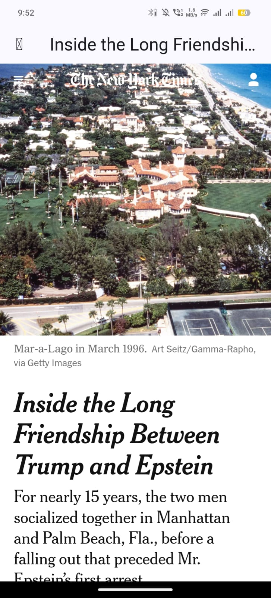

# RSS Feed 📡

A powerful and flexible Flutter package for fetching, parsing, and displaying RSS feeds with a customizable UI, robust image handling, and in-app WebView for seamless article reading.

[<image-card alt="Pub Version" src="https://img.shields.io/pub/v/rss_feed?color=blue" ></image-card>](https://pub.dev/packages/rss_feed)
[<image-card alt="License: MIT" src="https://img.shields.io/badge/License-MIT-blue.svg" ></image-card>](https://opensource.org/licenses/MIT)
[<image-card alt="GitHub Stars" src="https://img.shields.io/github/stars/bantirathodtech/rss_feed" ></image-card>](https://github.com/bantirathodtech/rss_feed)

---

## ✨ Features

- **📥 Fetch & Parse RSS Feeds**: Effortlessly retrieve and parse RSS feeds using the `xml` package.
- **📋 Configurable Feed List**: Display a list of RSS feeds with `FeedListScreen`, fully customizable via `RSSConfig`.
- **📰 Article List View**: Showcase articles from a selected feed using `FeedDetailScreen`.
- **🎨 Customizable News Cards**: Use `CustomNewsCard` for stylish article previews with title, description, date, and images.
- **📄 Detailed Article View**: Render article content with `ArticleDetailScreen`, featuring HTML tag removal for clean display.
- **🌐 In-App WebView**: Open full articles in `WebViewScreen` on mobile or external browsers on web/desktop.
- **🖼️ Robust Image Handling**: Extract images from `media:content`, `enclosure`, or `img` tags, powered by `cached_network_image` for efficient loading.
- **⚙️ Customization**: Configure themes, default images, and feed names with `RSSConfig`.
- **🌍 Cross-Platform**: Supports Android, iOS, web, Windows, Linux, and macOS.
- **🛠️ Developer-Friendly**: Modular design with utilities (`FeedParser`, `StringUtils`, `UrlUtils`) and comprehensive documentation.

---

## 🚀 Installation

Add the package to your `pubspec.yaml`:

```yaml
dependencies:
  rss_feed: ^1.0.0
Install it using:

bash/terminal/command prompt

flutter pub get
📖 Usage
Basic Setup with Configurable URLs
Display a list of RSS feeds using FeedListScreen with a customizable RSSConfig:

import 'package:flutter/material.dart';
import 'package:rss_feed/rss_feed.dart';

void main() {
  runApp(const MyApp());
}

class MyApp extends StatelessWidget {
  const MyApp({super.key});

  static const List<String> feedUrls = [
    'https://www.bbc.com/news/world/rss.xml',
    'https://rss.nytimes.com/services/xml/rss/nyt/HomePage.xml',
    'https://feeds.bbci.co.uk/news/technology/rss.xml',
    'https://www.thehindu.com/feeder/default.rss',
  ];

  @override
  Widget build(BuildContext context) {
    return MaterialApp(
      title: 'RSS Feed Reader',
      debugShowCheckedModeBanner: false,
      theme: ThemeData(
        colorScheme: ColorScheme.fromSeed(seedColor: Colors.blueAccent),
        useMaterial3: true,
      ),
      home: FeedListScreen(
        feedUrls: feedUrls,
        config: const RSSConfig(
          defaultImageUrl: 'https://via.placeholder.com/150',
          feedNames: {
            'https://www.bbc.com/news/world/rss.xml': 'BBC Global',
            'https://rss.nytimes.com/services/xml/rss/nyt/HomePage.xml': 'NYT Home',
            'https://feeds.bbci.co.uk/news/technology/rss.xml': 'BBC Tech',
            'https://www.thehindu.com/feeder/default.rss': 'The Hindu News',
          },
          theme: ThemeData(primarySwatch: Colors.blue),
        ),
      ),
    );
  }
}
Using Individual Components
Create custom UI flows with CustomNewsCard or other components:

import 'package:flutter/material.dart';
import 'package:rss_feed/rss_feed.dart';

class CustomArticleDisplay extends StatelessWidget {
  final RssItem item;

  const CustomArticleDisplay({super.key, required this.item});

  @override
  Widget build(BuildContext context) {
    return Scaffold(
      appBar: AppBar(title: Text(item.title ?? 'Article')),
      body: CustomNewsCard(
        title: item.title ?? 'Untitled',
        description: item.description ?? 'No description',
        date: item.pubDate ?? 'Unknown date',
        imageUrl: FeedParser.getImageUrl(item, fallbackImageUrl: 'https://via.placeholder.com/150'),
        onTap: () {
          if (item.link != null) {
            Navigator.push(
              context,
              MaterialPageRoute(
                builder: (context) => ArticleDetailScreen(
                  title: item.title ?? 'Untitled',
                  content: item.description ?? 'No content',
                  url: item.link!,
                  imageUrl: FeedParser.getImageUrl(item),
                ),
              ),
            );
          }
        },
      ),
    );
  }
}
🖼️ Screenshots

## 🖼️ Screenshots

| Feed List | Feed Detail | Article Detail | Web View |
|-----------|-------------|----------------|----------|
|  |  |  |  |

View link
Failed to load image

View link
Failed to load image

View link
🛠️ Contributing
We welcome contributions! To get started:

Fork the repository: github.com/bantirathodtech/rss_feed.
Create a pull request with your changes.
Report issues or suggest features via the issue tracker.
📄 License
This package is licensed under the MIT License.

📬 Support
For questions or support, reach out via the GitHub issue tracker or email bantirathodtech@gmail.com.

Built with ❤️ by Banti Rathod.